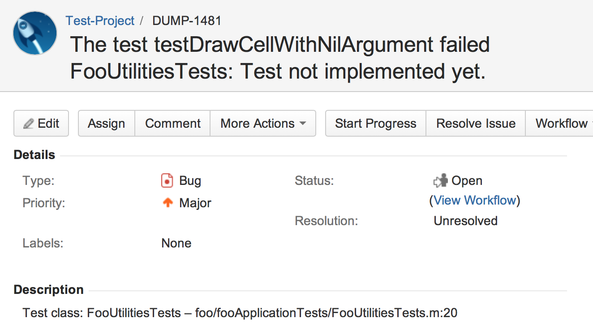
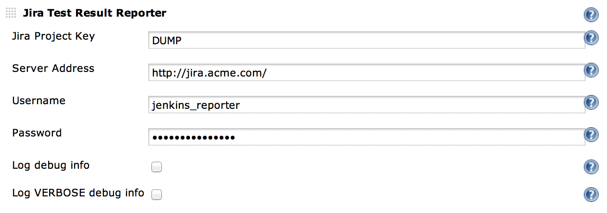

JiraTestResultReporter
======================

# This repo was the initial version of the plugin which I created years ago. The maintained version lives here: https://github.com/jenkinsci/JiraTestResultReporter-plugin

**DISCLAIMER**

**Though I tested this plugin on my Jenkins installation, I can't tell for sure that this works as intended. Maybe you want to check the code before using this plugin. Don't blame me, if your Jira gets filled with false issues (which is basically the worst thing, that this plugin can do.)**

### What is does
This plugin examines the build job for failed unit tests. So you'll have to add e.g. the "Publish xUnit test results report" to your build job. Otherwise JiraTestResultReporter has nothing to work with…

If JiraTestResultReporter detects *new* failed tests, it will create an issue for every test case in Jira.


### Installation

* ```cd``` into the downloaded directory
* execute the maven command ```mvn package```
* put the generated file ```JiraTestResultReporter.hpi``` to the plugins directory of your Jenkins installation or use the plugin uploader from *Manage Jenkins* -> *Manage Plugins* -> "Advanced" tab
* restart Jenkins

### Usage
* In the build build job add JiraTestResultReporter as a post-build action.
* Configure the plugin for this job. See the help boxes for details.



