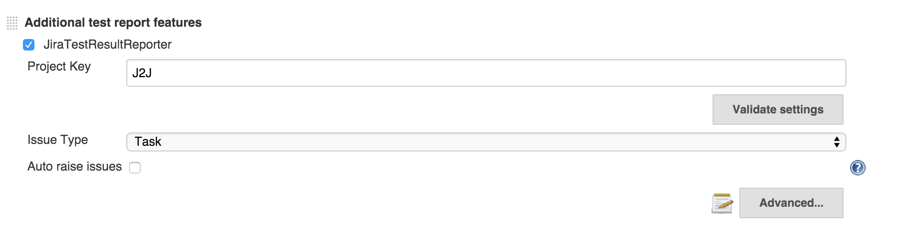

JiraTestResultReporter
======================

**Hello! Thank you for your interest in contributing to this plugin! If you were looking for the previous versions, please checkout the 1.x branch**

### How to submit a bug report/feature request
For submitting bug reports and feature requests please use the official [JIRA](https://issues.jenkins-ci.org) for Jenkins and specify in the component field **jiratestresultreporter-plugin** .

In case of bug reports, please specify:
* the plugin version
* the Jenkins version
* step by step instructions for how to reproduce the bug
* the result as you see it
* what do you think the expected result should be.

In case of feature requests please describe in detail what would you like this plugin to do and if possible specify your use case for it, so that make sure it is covered by an eventual implementation.

### How to contribute

Contributions for this plugin should be in the form of pull requests.

Before you make a contribution, please make sure that there is a JIRA ticket for the bug that you are fixing, or for the feature that you are implementing as specified above. In some trivial cases, like clean up, refactoring, fixing typos there is no need for a JIRA issue.

One pull request should solve one JIRA ticket. 

For your convinience you should try to use the following workflow:

**Setup workflow**
* Fork on GitHub (click Fork button)
* Clone to computer, use SSH URL ($ git clone git@github.com:${your_git_username}/JiraTestResultReporter-plugin.git)
* cd into your repo: ($ cd JiraTestResultReporter-plugin/)
* Set up remote upstream ($ git remote add upstream git@github.com:jenkinsci/JiraTestResultReporter-plugin.git)

**Fixing a bug/Implementing a feature workflow**
* Create a branch for the JIRA issue that you are solving ($ git checkout -b issue/JENKINS-XXXXXX)
* Develop on issue branch. [Time passes, the main repository accumulates new commits]
* Commit changes to your local issue branch. ($ git add . ; git commit -m 'JENKINS-XXXXXX - commit message')
* Fetch upstream ($ git fetch upstream)
* Update local master ($ git checkout master; git merge upstream/master)
* Rebase issue branch ($ git checkout issue/JENKINS-XXXXXX; git rebase master)
* Repeat the above steps until dev is complete
* Push branch to GitHub ($ git push)
* Start your browser, go to your Github repo, switch to "JENKINS-XXXXXX" branch and press the [Pull Request] button.

Please keep the PRs as clean as possible by not mixing two or more issues into a single PR, or refactoring/clean up/typo fixing with solving issue. 
If you can have the feature implementation in a single git commit, that's even better.
If you have splitted your work into many commits you can squash them into a single one afterwards, if it makes sense. 

In any case, every commit should be fully functional. As specified in the workflow the branch name and each commit message shoud contain the issue key. We would love it if you could also provide tests for you issue in the PR (even if we don't have any, yet :) ).

## WARNING: 2.x verions of this plugin are not compatible with the previous 1.x version. What this means is that your configurations related to this plugin will not be imported from previous versions when you do an upgrade.

### What is does
This plugin allows you to create and/or link issues from Jira to failed tests in Jenkins. The creation/linking is done directly in the Jenkins interface. For the creation of the issues you can supply a template for what is going to be added in most of the issue's fields. 

### Global Configuration
Before doing anything else, the global configurations must be done.
In order to do these go to **Manage Jenkins -> Configure System -> JiraTestResultReporter** and enter here the JIRA server url the username and password. It is highly recommended that you click the Validate Settings button every time you make any changes here.
Also from here you can configure the global templates for Summary and Description, by clicking on the Advanced button. These templates will be used to create issues if they are not overridden in the job configuration.


### Job Configuration

## Pipeline Style Jobs

You can see below and example of a pipeline usage.

The thing to keep in mind is that you need to use the field keys and the values as they are defined in the REST API. For example, for the 'issueType', the API expects the ID for the issue type, in this case '1', instead of 'Bug'.

```java
junit (
 testResults: '**/surefire-reports/*.xml',
 testDataPublishers: [
   jiraTestResultReporter(
     configs: [
       jiraStringField(fieldKey: 'summary', value: '${DEFAULT_SUMMARY}'),
       jiraStringField(fieldKey: 'description', value: '${DEFAULT_DESCRIPTION}'),
       jiraStringArrayField(fieldKey: 'labels', values: [jiraArrayEntry(value: 'Jenkins'), jiraArrayEntry(value:'Integration')])
     ],
     projectKey: 'J2J',
     issueType: '1',
     autoRaiseIssue: false,
     autoResolveIssue: false,
     autoUnlinkIssue: false,
   )
 ]
)
```


## Classic Jobs 

The first thing we need to do here is enabling the plugin:
 * **Freestyle projects** and **Multi-configuration projects**

     First, JUnit test reports need to be enabled by going to **Add post-build action -> Publish JUnit test report**. Then check the box next to **JiraTestResultReporter** in the **Additional test report features section**.

 * **Maven Project**

     **Add post-build action -> Additional test report features** -> check the box next to **JiraTestResultReporter**.

**Configuration:**

Insert the **Project key** in the respective field. Again, highly recommended to push the Validate Settings.

After setting the project key the **Issue type** select will be populated with the available issue types for that specific project.

If you check the **Auto raise issue** check box, this plugin will create and link issues for all the failing tests in new builds that don't already have linked issues.

Checking **Auto resolve issue** check box will enable an experimental feature. Basically, if you had a test that was failing and you had a linked Jira issue to it, the plugin will try to resolve your issue. What this means is that it will look for available transitions from the current state and it will try to find one that in the name has the word "resolve". If such a transition is found it will apply it, otherwise it will just log a message. In future releases this will be configurable.



Only after configuring the fields above, if you want you can override the **Summary** and **Description** values by clicking the **Advanced** button. 
If you want, here you can configure all available fields for that specific issue type. Due to Jenkins interface development limitations, you have to search for the desired field from the four available types of fields, after clicking the Add Field Configuration.

**Important: Do not leave empty values for fields, if you didn't find the desired field in the current chosen option, delete it before trying the next one.**

Finally, I cannot say that this is recommended ( although it is (smile) ), **read the help tag for the Validate Fields** and if the warning there is not a problem for you click the button.


### Usage
After building the project, go to the test results page. Next to the test cases you will see a **blue plus button**, next to a **No issue** message. If you want to **create an issue**, or **link an existing one**, click the blue plus button and choose the desired option. For **unlinking** an issue, click the **red x button**.

**When creating, linking and unlinking issues, you it is recommended that wait for the page to reload, before doing something else for another test.** Errors will be shown inline, if any.


Finally, your issues are created and you can see them by clicking the links directly from the Jenkins interface.


### Variables
For text fields in the Job Configuration and Global Confinguration (Summary and Description only) you can use variables that will expand to the appropriate value when the issue is created in JIRA. You can use all the environment variables defined by Jenkins (see [link](https://wiki.jenkins-ci.org/display/JENKINS/Building+a+software+project)). Additionaly, this plugin can expand a set of predefined variables that expose information about the test.


### Implementation details


